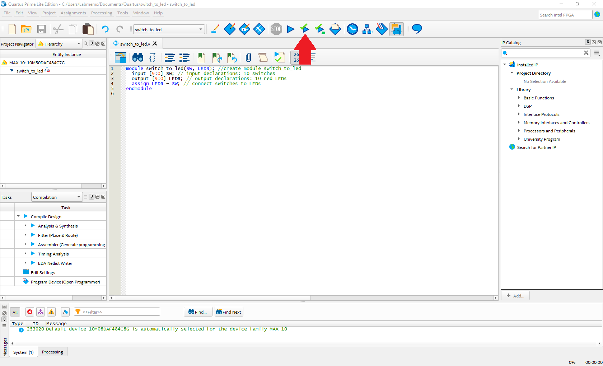

<div align="right">


V1.0 - 7/11/2021
</div>

# TC2039 - Desarrollo de Sistemas Digitales
## Actividad 2.1 - Introducción y características de VHDL

## Contents

1. [Quartus Prime 21.1 Lite Installation](#1-quartus-prime-211-lite-installation-1)

    1.1 [Background](#background-1)

    1.2 [Installation](#installation-1)

2. [New Project Wizard](#2-new-project-wizard-1)
    
    2.1 [Navigation of Quartus Prime Lite](#21-summary-1)

    2.2 [Navigation of Quartus Prime Lite](#navigation-of-quartus-prime-lite-1)

    2.3 [New Project Wizard](#new-project-wizard-1)
3. [Switch to LED](#3-switch-to-led-1)

    3.1 [Summary](#31-summary-1)

    3.2 [Creating a New File](#32-creating-a-new-file-1)

    3.3 [Adding Verilog Code](#33-adding-verilog-code-1)

    3.4 [Assigning Pins](#34-assigning-pins-1)

## 1. Quartus Prime 21.1 Lite Installation

### 1.1 Background
A field-programmable gate array, or FPGA, is a digital semiconductor that can be used to build a wide variety of electronic functions. These data center accelerators, wireless base stations and industrial motor controllers to name but a few common applications. This is because FPGAs can be infinitely reconfigured to perform different digital hardware functions, which also makes for an
excellent learning platform.

To configure an FPGA, first you describe your digital electronics with either a Hardware Description Language (HDL), such as Verilog or VHDL, or a schematic. Then you assign the “pins” of your FPGA based on how the Printed Circuit Board (PCB) connects the FPGA to various peripheral components on your board. Some examples of peripherals are switches, LEDS, memory devices and various connectors. Finally, you “compile” your design and program the FPGA to perform the function you have specified in the HDL or schematic.

This training class assumes you have some prerequisite knowledge of how computers and digital electronics work, but by no means do you need an electrical engineering degree to follow along this introductory course.

### 1.2 Installation

Go to the [Intel FPGA software download site](https://fpgasoftware.intel.com/?edition=lite). Make sure to select Lite edition, version 21.1, and your corresponding Operating System (only available for Windows and Linux).

<div align="center">

</div>

Download the Quartus Prime installer, along with the MAX 10 FPGA device support pack, and save both files on the same folder. 

<div align="center">

</div>

Run the `QuartusLiteSetup[...].exe` file to initiate the IDE installation. The Setup Wizard will show up with a welcome screen, as shown below. Just click __Next__.

<div align="center">

</div>

Accept the software License Agreenment and click __Next__.

<div align="center">

</div>

If you opt to install the software on a different folder than the default installation directory, change the installation path on the _**Installation directory**_ window. If not, just click __Next__.

<div align="center">

</div>

If you saved the Quartus Prime Lite installation file and the MAX 10 FPGA device support pack on the same folder, on the _**Select Components**_ window you should see and select the MAX 10 FPGA support pack to install alongside the Quartus Prime software. Make sure that both, Quartus Prime Lite Edition and MAX 10 FPGA (under Devices branch) options are checked for installation and click __Next__. 

<div align="center">

</div>

A Summary window will show the installation folder, as well as the available and required disk space for installation. Double check the installation folder and make sure you have enough disk space for installation. If so, click __Next__ to proceed with the installation. 

<div align="center">

</div>

Once the installation is completed in your system, a notification window will appear showing some pre-selected options by default. Keep the checked boxes as is, and click __Next__.

The Device Driver Installation Wizard window must show up, asking to install the Altera JTAG cables driver. Click on __Install__ to proceed. 

<div align="center">

</div>

Once installation is complete, a Ready-to-use notification window must show that the Altera JTAG cables driver is installed and ready to be used. Click __Finish__.

<div align="center">

</div>


## 2. New Project Wizard

### 2.1 Summary
This is a short lab that completes the basic project setup. At the end of this lab, you will be able to start a new project using New Project Wizard in Quartus Prime Software. There are other related tutorial links provided for you to learn more about the software.

### 2.2 Navigation of Quartus Prime Lite
The first time you open Quartus Prime, a software licensing window will ask on acquiring a license. Select the _**Run the Quartus Prime software**_ option, as shown below, and click __OK__. 

<div align="center">

</div>

After this, the main window will be shown.

<div align="center">

</div>

The Quartus Prime main window is composed of the following sections:

* __Project Navigator__ shows your project hierarchy, source files, design units, IP and design revisions in your project.
* __Tasks__ window shows the status of the design and can be used to run or re-run parts of the
design flow 
* __Messages__ window outputs messages from each process of the run.
* __Files__ window has tabs for the report browser, open design files and any other file opened by the user.
* __IP Catalog__ window is open by default and is used to generate IP functions that are to be
used in your design.

### 2.3 New Project Wizard
In the main toolbar of Quartus, navigate to the File drop down menu and New Project Wizard.

<div align="center">

</div>

__Pane 1: Introduction.__ There is nothing to configure on this pane. Click __Next__ to continue.

<div align="center">

</div>

__Pane 2: Directory, Name, Top-Level Entity.__

* Fill in with a directory of your choice. It is recommended to be a personal directory, and not a directory under Quartus installation which is the default.

* Call the project _**switch_to_led**_ and the top level entity _**switch_to_led**_.
The name of the top-level design entity is case-sensitive so ensure that you type the name in all lower-case. See figure below for a completed Pane 2.

*Note: the screen shots will have a different directory than what you will use
for your project. This is fine!*

<div align="center">

</div>

__Pane 3: Project Type.__ Select **Empty project.** Click **Next.**

<div align="center">

</div>

__Pane 4: Add Files.__ Click __Next.__ We will add project source files later.

<div align="center">

</div>

__Pane 5: Family, Device, and Board Settings.__

* Family should be set to __MAX 10__. Make sure the tab is set to Device.

* The part number for the FPGA chip you will use is __10M50DAF484C7G__. You need to type this number in the _Name filter_ bar.

<div align="center">

</div>

__Pane 6: EDA Tool Settings.__ Skip this section and click __Next__. This section is only needed if you are using other development software besides Quartus Prime.

<div align="center">

</div>

__Pane 7: Summary.__ Pane 7 should look similar to the image below.

*Note: you now have a project called switch_to_led, and top-level entity called switch_to_led, no files selected (yet) and are using a MAX 10 device.*

Click __Finish__.

<div align="center">

</div>

You should now see something similar to the screenshot shown below (__The Tool View Window__ may just have a gray Quartus Prime screen. This is fine.)

<div align="center">

</div>

Some windows may not be shown by default. To customize what windows are shown, click on the _View_ tab and look under the Utility Windows drop down as seen in the following figure.

<div align="center">

</div>

If you navigate in __Windows Explorer__ to your project directory, you will see some files and directories created by the __New Project Wizard__ as part of the setup process.

## 3. Switch to LED
### 3.1 Summary
This lab will step you through the process of a simple design from generating your first Verilog file to synthesize and compile. Synthesis converts your Verilog language file to an FPGA specific “netlist” that programs the programmable FPGA lookup tables into your desired function. Compilation figures out the location of the lookup table cells used in the FPGA and generates a
programming image that is downloaded to your Intel FPGA Development kit. At the end of this lab, you will be able to test the functionality of the example digital electronic circuits by toggling the switches and observing the LEDs for proper circuit operation.

### 3.2 Creating a New File
Create a Verilog HDL file. Go the __File__ dropdown menu and select __New__. 

A window, similar to the shown below, should pop up. Click on __Verilog HDL File__ and then __OK__.

<div align="center">

</div>

### 3.3 Adding Verilog Code
Create a simple module in your Verilog HDL file copying/pasting this code from the file
[_**switch_to_led.v**_](switch_to_led.v).

The code you will use is displayed below. Do not cut and paste from here as sometimes cut and paste from a GitHub pdf or downloaded pdf introduces some illegal characters.

```verilog
module switch_to_led(SW, LEDR); //create module switch_to_led
input [9:0] SW; // input declarations: 10 switches
output [9:0] LEDR; // output declarations: 10 red LEDs
assign LEDR = SW; // connect switches to LEDs
endmodule
``` 

Make sure carriage returns and new lines are in the right location or your code will not
compile properly! Verilog treats all blank space (spaces or tabs) the same.

__BRAIN EXERCISE:__ Check your syntax carefully! Can you explain what this circuit does?

Click on __File__, name the file as _**switch_to_led**_ (ensuring case-sensitivity), and click
__Save As…__ to save your Verilog file.

Next you will run __Analysis and Elaboration__. Analysis and Elaboration checks the syntax of your Verilog code, resolves references to other modules and maps to FPGA logic. If you see any errors during the Analysis and Elaboration step, carefully review your Verilog code for syntax errors and re-run this step. 

To run __Analysis and Elaboration__, click the Play button with a green check mark,
shown in the figure below.

<div align="center">

</div>

### 3.4 Assigning Pins
By default, Quartus Prime does not know how the FPGA pins on the DE10-Lite development board are connected to the switches and LEDs used in this circuit. Because our FPGA is already on a PCB, we need to tell Quartus what pins to use. Although Quartus allows you to select a development board with a predefined pinout, this lab shows you how to define your own pinout as an exercise.

<div align="center">

</div>

The next steps will assign the switches and LED signals in your code to the appropriate pins.

Using the main toolbar at the top of the Quartus window, navigate to the __Assignments__ dropdown menu as shown above. Click on __Pin Planner__ and a window similar to the image below should open.

<div align="center">

</div>

We can see the I/O pins have not been assigned to any locations yet. To make the right pin assignments, refer to the table below.

*Note: The switch_to_led lab does not require the CLOCK_50 signal but it will be used in
the final lab and will resolve when you run that lab.*

<div align="center">

| Node name | Location | I/O Standard |
|---|---|---|
| LEDR[9] | PIN_B11 | 3.3 LVTTL |
| LEDR[8] | PIN_A11 | 3.3 LVTTL |
| LEDR[7] | PIN_D14 | 3.3 LVTTL |
| LEDR[6] | PIN_E14 | 3.3 LVTTL |
| LEDR[5] | PIN_C13 | 3.3 LVTTL |
| LEDR[4] | PIN_D13 | 3.3 LVTTL |
| LEDR[3] | PIN_B10 | 3.3 LVTTL |
| LEDR[2] | PIN_A10 | 3.3 LVTTL |
| LEDR[1] | PIN_A9  | 3.3 LVTTL |
| LEDR[0] | PIN_A8  | 3.3 LVTTL |
| SW[9]   | PIN_F15 | 3.3 LVTTL |
| SW[8]   | PIN_B14 | 3.3 LVTTL |
| SW[7]   | PIN_A14 | 3.3 LVTTL |
| SW[6]   | PIN_A13 | 3.3 LVTTL |
| SW[5]   | PIN_B12 | 3.3 LVTTL |
| SW[4]   | PIN_A12 | 3.3 LVTTL |
| SW[3]   | PIN_C12 | 3.3 LVTTL |
| SW[2]   | PIN_D12 | 3.3 LVTTL |
| SW[1]   | PIN_C11 | 3.3 LVTTL |
| SW[0]   | PIN_C10 | 3.3 LVTTL |
| CLOCK_50 | PIN_P11 | 3.3 LVTTL |

</div>

__TO ASSIGN PINS__

Match the __Signal Name__ (1st column) with the __FPGA Pin Location__ (2nd column) in the table above Also, assign each pin a __3.3 LVTTL__ standard. Assign __LEDR[9]__ to __PIN_B11__ by typing `PIN_B11` in the Location column in the __Pin Planner__.

___Note:__ the signal names in your code and names in the manual don’t have to match. As long as you connect the names in your design to the proper pin location, your design will be connected properly. In this lab, we have named the signals as a vector so pin names are of the form LEDR[0], LEDR[1], and so on._

An alternate method is to left-click on the __Node Name__ in the __Pin Planner__ and drag the pin on top of the ball grid map location assigned in the table. Release the pin on the proper location. Hit the escape key and move to the next pin. Assign __LEDR[8]__ to __PIN_A11__ using this method.

When you finish, you can just close the window (the __Pin Planner__ does not have a __Save__ button, but it will save anyways). This _**switch_to_led**_ lab does not require the `CLOCK_50` signals so you can ignore these for the time being. The clock signal will be required in further labs, so you will need to assign it prior to compiling that lab.

Last, we will assign the remaining pins using a TCL command. In Quartus, proceed to __View → Utility Windows → TCL Console__. You should see a window across the bottom of your Quartus window as shown below. If it doesn’t show up, try the command again as this toggle the window on and off.

<div align="center">

</div>

Open this file that contains the TCL pin placement commands: [_**DE10_Lite_pins.tcl**_](DE10_Lite_pins.tcl).

Copy the commands from the file and enter them in the TCL Console window. Note that if you reassign pins that have already been assigned in the pin planner, this will not cause a problem, as long as the pin locations are correct. Make sure that carriage returns are properly copied over from these TCL commands into the TCL utility window. If all the lines in the DE10_Lite_pins.tcl show up on one line, try another editor (e.g., vi seems to merge all the lines and notepad includes the carriage returns). If all 21 TCL commands show up as a single continuous line, you will need to copy and paste each command one at a time or copy from a different editor. The beginning of each line starts with `set_location_assignment`.

___Note:__ Make sure you enter the last carriage return entered in the TCL command
window to pick up the last line `CLOCK_50 pin location`._

Now the remaining pins have been assigned for you by the script. To check what has been  assigned, you can return to the __Pin Planner__ application or alternatively open the __Assignment Editor__ Window (_**Assignments → Assignment Editor**_) to check that the TCL commands have properly set the pinout for your Switch to LED design. Try both methods to familiarize yourself with different techniques to manage and observe pin constraints. Note the direction of the ports since they match your _switch_to_led_ design. `CLOCK_50` port is indicated with a question mark since it doesn’t exist in your design, but will be used in a subsequent lab.

<div align="center">

</div>

### 3.5 Compiling Your Code
Click the Start Compilation button, located at the top of the main Quartus window, to start the full compilation of your code. You can also go to: Processing → Start Compilation.

After roughly 1 to 2 minutes depending on your machine type and amount of RAM, the compilation should complete and there should be 0 errors. (You can ignore warnings.)

<div align="center">

</div>

### 3.6 Driver Installation and FPGA Programming
A successful compilation will produce an SRAM object file, which configures the interconnect and logic of the FPGA to implement your RTL. This file is produced in the `output_files` folder of your Quartus project directory. We need to tell Quartus to program this file to our FPGA. 

Additionally, we need the Quartus Programmer tool to know what devices are on the JTAG chain. To program the FPGA the proper drivers must also be installed. Perform the following steps to configure drivers and program the DE10-Lite using the Quartus Prime Programmer tool.
1. Ensure the USB cable is connected from the DE10-Lite to the host computer. This should automatically power on the development kit.
2. Open your __Device Manager__ by hitting the Windows Key and typing Device Manager.
3. Navigate to the __Other Devices__ section of the __Device Manager__ and expand to reveal the __USB-Blaster__ device, if it is in another device category, the drivers may have previously been installed.

<div align="center">

</div>

4. Right-click on __USB-Blaster__ to select __Update Driver__ and choose to browse your computer for driver software and navigate to the following directory path: `%QUARTUS_ROOTDIR%\intelFPGA_lite\18.0\quartus\drivers` where `%QUARTUS_ROOTDIR%` is the installation directory of Quartus Prime Lite.

<div align="center">

</div>

5. Once you have the proper file path selected, click __Next__ and the driver for the __USB Blaster__ should be installed.

<div align="center">

</div>

6. With the drivers installed we may now program the FPGA on the DE10-Lite. First, open the programmer tool from Quartus by navigating _**Tools → Programmer**_.

<div align="center">

</div>

7. If drivers were successfully installed, next to the __Hardware Setup…__ button, you should see __USB_Blaster [USB-XX]__ indicating an SoC-type DE development kit has been detected.
a. If not, you may need to click __Hardware Setup__ and from the __Currently selected hardware__ dropdown menu select __USB_Blaster [USB-XX]__ and press __Close__.
8. Click __Auto Detect__.
9. Finally check the __Program/Configure__ box for the 10M50DAF484 FPGA device and press __Start__.
10. Verify that the Progress bar indicates __100% (successful)__. Now you can play with the board slide switches and see what happens.

<div align="center">

</div>

